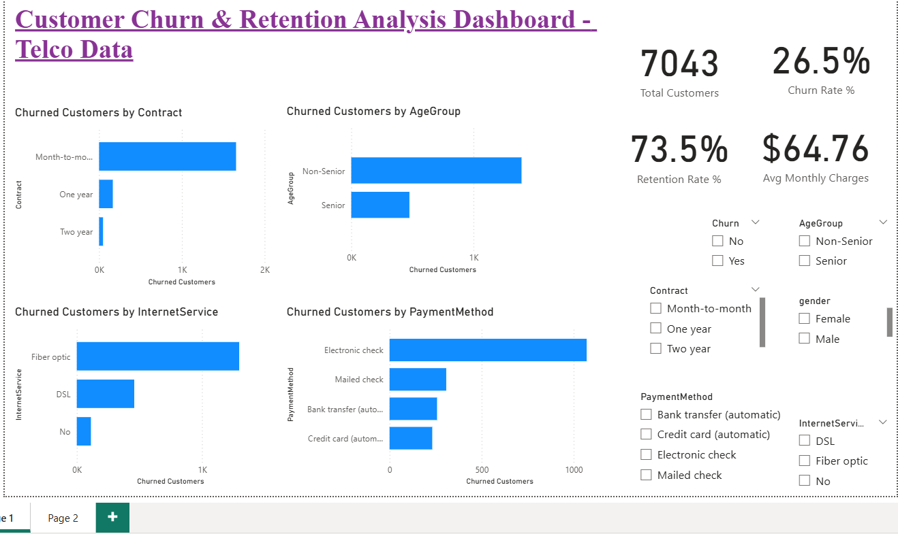

# powerbi-telco-churn-analysis
Customer churn and retention analysis using Power BI

## Dashboard Overview 

## Objective
Analyze customer churn in a telecom dataset to identify key churn drivers and provide actionable retention strategies.

## Dataset
- Telco Customer Churn dataset
- Each row represents a customer with service, billing, and churn information

## Tools Used
- Power BI Desktop
- Power Query
- DAX

## Key KPIs
- Total Customers
- Churn Rate
- Retention Rate
- Average Monthly Charges

## Key Insights
- Month-to-month contract customers show the highest churn.
- Electronic check payment method has significantly higher churn.
- Fiber optic internet users churn more than DSL users.
- Non-Senior customers churn rate is higher than Senior customers.

## Buisness Recomendations
- Incentivize long-term contracts to reduce churn.
- Promote automatic payment methods.
- Improve fiber optic service quality.
- Run win-back campaigns for high value churned customers.

## Outcome
An interactive Power BI dashboard that helps stakeholders identify churn patterns and take data-driven retention actions.
